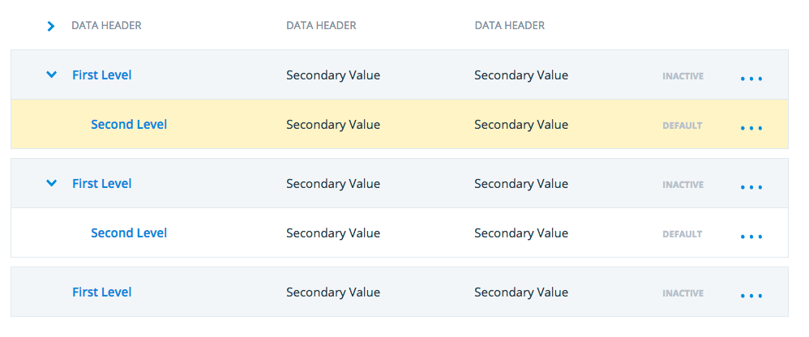

### New Pattern
* There is a new pattern that highlights new and unsaved data elements. This pattern can be applied to cards, tables, and trees. An example of this pattern used in a tree, is shown in the following screenshot:
  

### Minor updates
* A new modifier class added to the expandable button pattern prevents the **expanded options** from breaking the other elements in the layout.
* There is a new **Custom Select** element added to the form components.
* There are improvements to the documentation.
* Vendor-specific CSS prefixes are now added automatically
