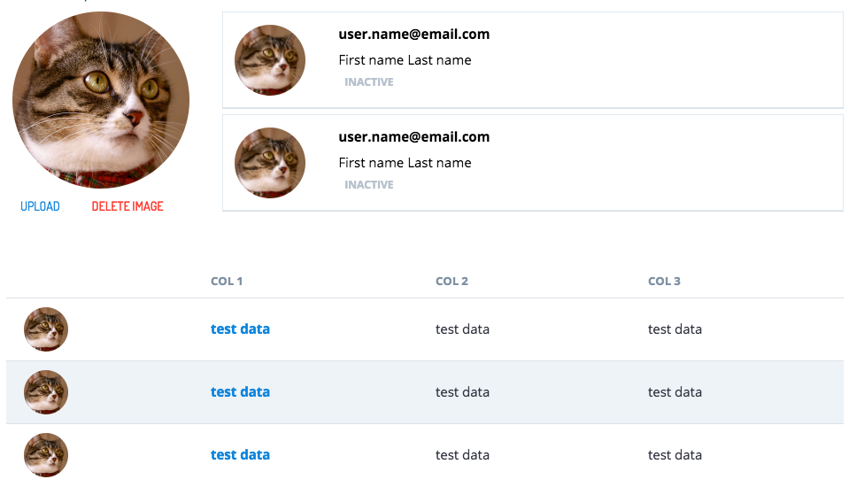

### New Pattern
* A new pattern defines how to display avatars and images on cards and tables -using standard sizes. This pattern also defines the HTML markup and the user interaction to follow when uploading or changing images.
  

### Minor updates
* The **Tree Pattern** HTML Markup is simplified. Complex use of CSS classes along with HMTL attributes is improved.
* The **Toggle buttons** now have a stylized *1/0* label instead of on/off. This change provides a more universal, conceptual representation for the toggle buttons, so there is no need to translate the button labels.
* Improved accessibility on the **Expandable Button**. The expandable options are now in a more accessible order. Secondary options are now at the bottom of the widget and do not obscure the primary options anymore.
* **Checkboxes** and **Radiobuttons** components now represent the *:focused* and *:active* statuses visually.
* The **Localised Editor** is extended to display *static content*.
